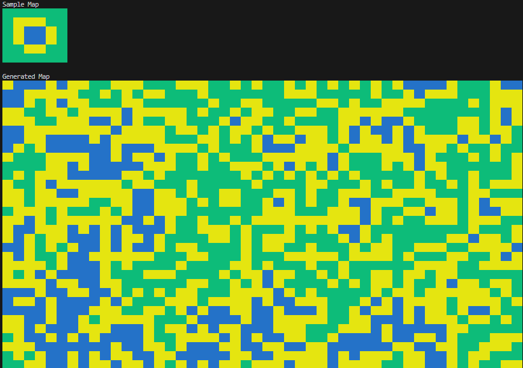
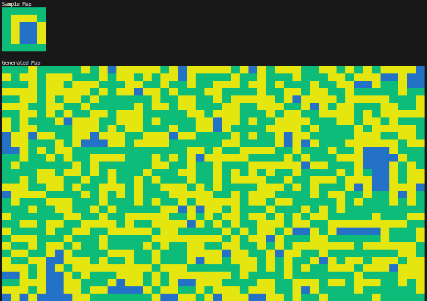
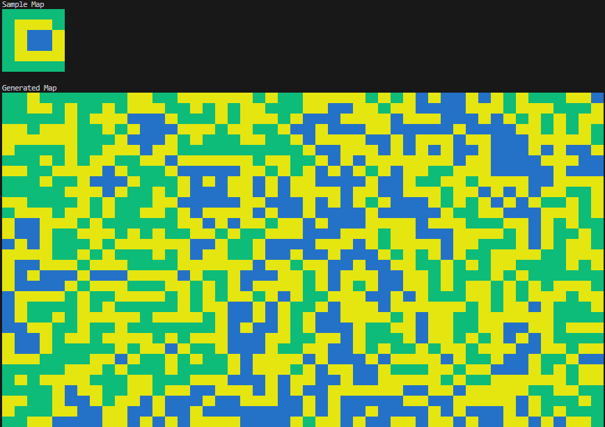

# wave_function_collapse
My journey to learning about the WFC algorithm.

 
_Example of a simplified WFC implementation with overlapping model_

## Intro
This isn't meant to be a tutorial and it's probably not the greatest reference. This is just my own sandbox for trying to make sense of wave function collapse. If you have suggestions, please make an issue and let's start a discussion. These algorithms can be difficult for me to wrap my mind around at times, so all perspectives are appreciated.

#### Notes
- I use `cell` and `tile` interchangeably.
- I also use `map`, `tilemap`, and `grid` interchangeably.
- I'll say `sample map` and `input map`, referencing the same thing.

_I do all of this intentionally, of course._ 😂

## Simplified WFC
[`simpler.py`](src/wave_function_collapse/simpler.py)

Here is my exploration of Robert Heaton's simplified WFC algorithm, which they've coined the "Even Simpler Tiled Model".

### Outline
1. Create a map, which is an array where each element is another array of possibile tiles that can be placed at this grid position in the map _*_
1. For each tile in our map
    1. Find the tile with the lowest entropy _**_
    1. Collapse the tile _***_
    1. Propagate the changes _****_
1. Render the map

_*_ The map can be represented in 1D and rendered in 2D using a specified number of columns and `divmod`. 
_**_ Lowest entropy in this simplified algorithm is just the length of possibile tiles for a specific grid position in the map. 
_***_ To collapse the tile, we literally just pick a tile from the possible tiles with the specified weights. 
_****_ First we need to get the neighboring cells. Once obtained, we need to see if the connection between the current cell and the neighbor cell exists for the neighbor's direction we are checking. It sounds complicated, but it boils down to creating a `Connection` object and seeing if it exists in our `CONNECTIONS` list. At a high-level, we are checking each possiblity and removing them if their connections are invalid.

### Output Examples
Run : `python simpler.py` 
Demo: https://onlinegdb.com/XJiyrlM78F

You can manually change values in the `USER CONFIG` section of the source code, including the generated maps size (rows and columns) and the weights of each of the tiles. Below are examples of changing the weights.

_(Remember, these weights are relative and their constraints affect each other. You can also modify `CONNECTIONS` list to get different behavior, including removing a connection, adding in new connections, or even creating new tiles altogether!)_

#### Weights: SEA(1.0), COAST(1.0), LAND(1.0)

#### Weights: SEA(1.0), COAST(0.5), LAND(1.0)

#### Weights: SEA(1.0), COAST(0.5), LAND(0.5)

## Simplified WFC with Overlapping
[`simpler_with_overlapping.py`](src/wave_function_collapse/simpler_with_overlapping.py)

This is an extension of the `Simplified WFC` implementation that supports the overlapping model instead of explicitly defining the connection rules. For this method, you provide a sample map and the algoritm will derive the connection rules and weights from the provided sample map.

In this implementation, I started with a copy of `simpler.py`. I wanted to modify the way weights work; instead of weights being per tile type, I wanted the weights to be per tile connection. This means a tile's neighbors have independent weights. For example, if `SEA` is completely surrounded by `COAST`, but never connects to `LAND`, there is no chance of `LAND` being picked next to an already placed `SEA` tile.

### Limitations
- Certain input maps will cause the algorithm to break when a rule doesn't exist. If `SEA` defines no connection rules for a neighbor, that means if `SEA` is placed, it will have no possible neighbors.
- Whether this is actual overlapping... I highly doubt it. But the algorithm is definitely derived from the ideas behind the overlapping model presented in WFC.

### Output Examples
Run : `python simpler_with_overlapping.py` 
Demo: https://onlinegdb.com/ewefezcQ2

You can play around with changing the `sample_map` within the `main()` function. This is a bit tedious at the moment and potentially buggy.

## Todos
### Tileset Complexity
More tiles with more constraints. Some transitional tiles will be cool to see. Also, corner tiles that only align in one way.

### Loading external data
Tiled support would be great. It would make creating input sample maps much easier. It would also give a reason to this tool, exporting generated maps to a usable format.

## References
- Where it all began: https://github.com/mxgmn/WaveFunctionCollapse
- Simplified WFC algorithm overview: https://robertheaton.com/2018/12/17/wavefunction-collapse-algorithm/

I've read much more on the topic, but these are the stand outs that I referenced the most.
