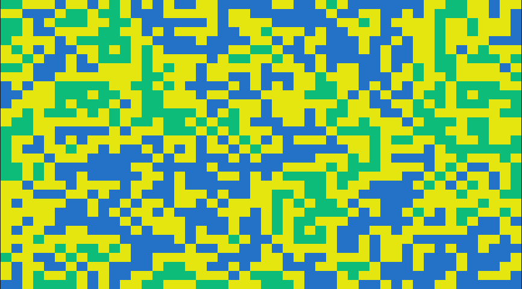
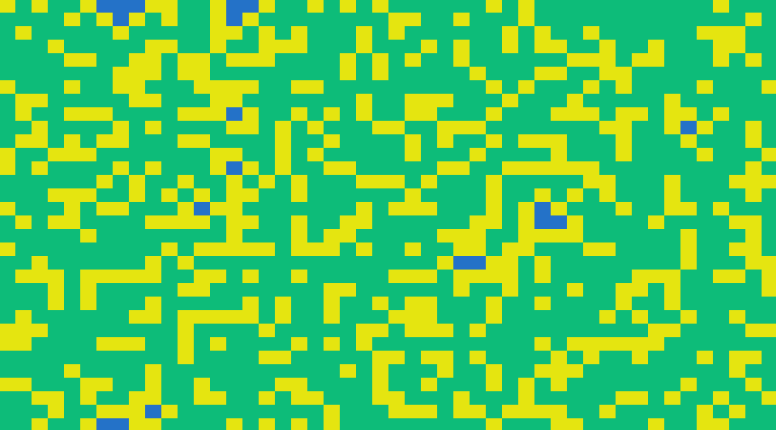
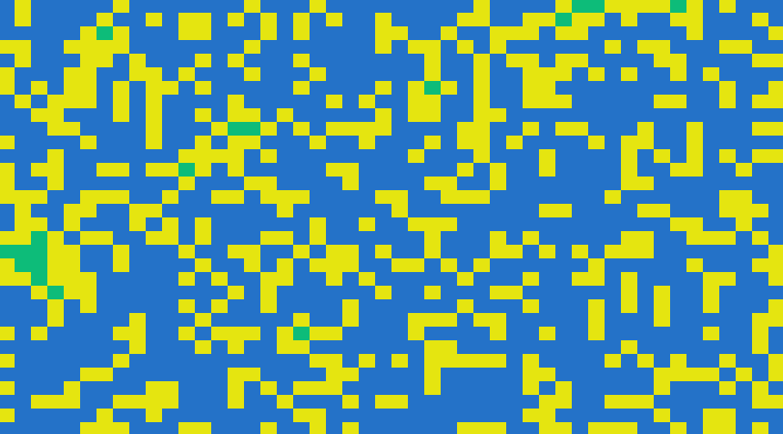

# wave_function_collapse
My journey to learning about the WFC algorithm.

## Simplified WFC
[`simpler.py`](src/wave_function_collapse/simpler.py)

Here is my exploration of Robert Heaton's simplified WFC algorithm, which they've coined the "Even Simpler Tiled Model".

## Outline
1. Create a map, which is an array where each element is another array of possibile tiles that can be placed at this grid position in the map _*_
1. For each tile in our map
    1. Find the tile with the lowest entropy _**_
    1. Collapse the tile _***_
    1. Propagate the changes _****_
1. Render the map

_*_ The map can be represented in 1D and rendered in 2D using a specified number of columns and `divmod`. 
_**_ Lowest entropy in this simplified algorithm is just the length of possibile tiles for a specific grid position in the map. 
_***_ To collapse the tile, we literally just pick a tile from the possible tiles with the specified weights. 
_****_ First we need to get the neighboring cells. Once obtained, we need to see if the connection between the current cell and the neighbor cell exists for the neighbor's direction we are checking. It sounds complicated, but it boils down to creating a `Connection` object and seeing if it exists in our `CONNECTIONS` list. At a high-level, we are checking each possiblity and removing them if their connections are invalid.

### Output Examples
`python simpler.py`

You can manually change values in the `USER CONFIG` section of the source code, including the generated maps size (rows and columns) and the weights of each of the tiles. Below are examples of changing the weights.

_(Remember, these weights are relative and their constraints affect each other. You can also modify `CONNECTIONS` list to get different behavior, including removing a connection, adding in new connections, or even creating new tiles altogether!)_

<i>Weights: SEA(1.0), COAST(1.0), LAND(1.0)</i>

<i>Weights: SEA(1.0), COAST(0.5), LAND(1.0)</i>

<i>Weights: SEA(1.0), COAST(0.5), LAND(0.5)</i>

## References
- Where it all began: https://github.com/mxgmn/WaveFunctionCollapse
- Simplified WFC algorithm overview: https://robertheaton.com/2018/12/17/wavefunction-collapse-algorithm/